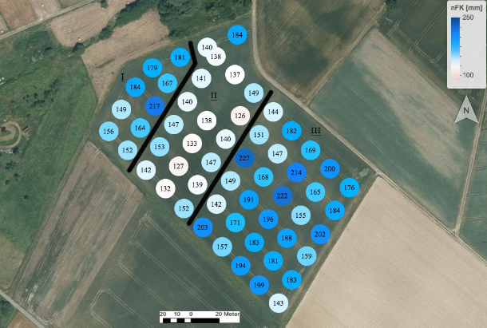

# BodenKarte

The Soil Map project enables the visualization of points on maps and the interpolation between these points based on the values of raster data. This allows for precise representation of spatial changes and relationships within the soil profile.

## Example input table:

| Raster Point | nFK      | Easting    | Northing   | lat        | lon        |
| ------------ | -------- | ---------- | ---------- | ---------- | ---------- |
| R101         | 143.8745 | 2577375.28 | 5603974.92 | 50.5663482 | 7.0914897  |
| R102         | 199.4895 | 2577359.84 | 5603988.84 | 50.5664754 | 7.09127465 |
| R103         | 194.1245 | 2577344.94 | 5604003.69 | 50.5666108 | 7.09106745 |
| R104         | 157.8218 | 2577330.26 | 5604018.45 | 50.5667454 | 7.09086332 |

A possible input table could look as shown above.

The result of the interpolation could look like this:

